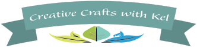
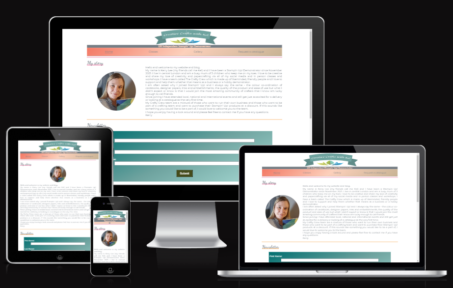
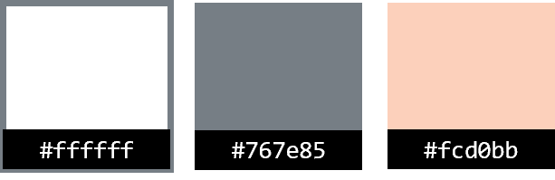
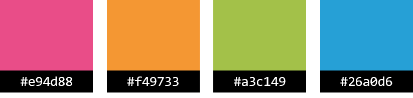
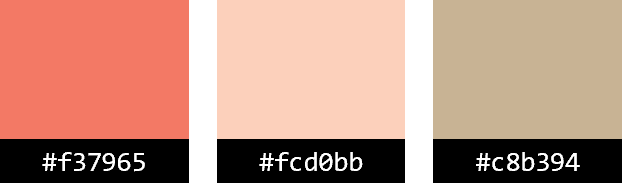
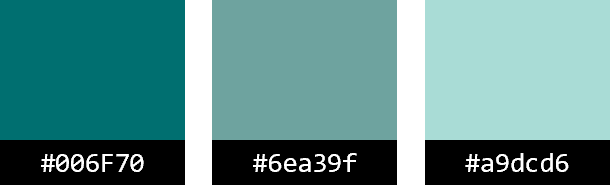
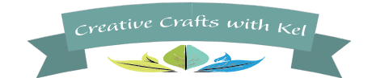
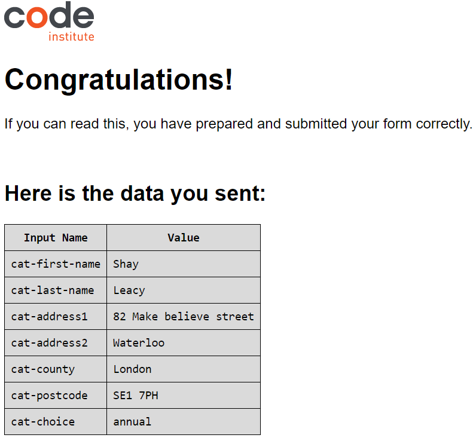

# Creative Crafts with Kel is envisioned as a community hub, where like-minded crafters and hobbyists can come for inspiration, information and to see the important announcements coming from Stampin' Up!

The site homepage contains links to internal pages and sections, external sources for the Stampin' Up! shop and catalogues and a newsletter sign-up form.

Other pages include a 'join the team' page, 'gallery' of pictures and a page to request a physical copy of the catalogues.

In the 'monthly card workshop' section there is information regarding community crafting sessions.  
A place for people to come together in person and craft together.

[View Creative Crafts with Kel live project here](https://hobbesunleashed.github.io/creative-crafts-with-kel/index.html)

- - -
## Table of Contents

### [User Experience (UX)](#user-experience-ux-1)
* [User Stories](#user-stories)
### [Design](#design-1)
### [Features](#features)
* [Existing Features](#existing-features)
### [Features Left to Implement](#features-left-to-implement-1)
### [Technologies Used](#technologies-used-1)
### [Frameworks, Libraries & Programs Used](#frameworks-libraries--programs-used-1)
### [Testing](#testing-1)
* [Validation Results](#validation-results)
* [Manual Testing](#manual-testing)
* [PageSpeed Insights Report](#pagespeed-insights-report)
### [Deployment and local development](#deployment-and-local-development-1)
* [GitHub Pages](#github-pages)
* [Forking the GitHub Repository](#forking-the-github-repository)
* [Local Clone](#local-clone)
### [Credits](#credits-1)
### [Acknowledgements](#acknowledgements-1)
---

## User Experience (UX)

This website was devised to attract people who like to craft using paper, card and other household materials.

There is clear navigation and a forms set up on the index and catalogue pages for newsletters and catalogues .

Users can view a selection of past creations and follow the social media links in the footer for further examples of work.

### User Stories

 * First-time visitor goals
    * Understand the main purpose of the site and learn more about Kerry and what she stands for.
    * Easily navigate throughout the site.
    * Find the Newsletter Sign Up form and fill it out.
 * Returning visitor goals
    * Find out information about Stampin' Up!
    * Request a catalogue.
    * Review the site's extensive gallery.
    * Find out about classes or workshops
 * Frequent user goals
    * Visit the Stampin' Up! shop - using Kerry's demonstrator code.
    * Review the gallery for any new photos.
    * Join Kerry's Stampin' Up! team
- - -

## Design

 * Colour Scheme
    * Primary colors used on the website:   
    

    * Secondary colors used on the website:   
    

    * Gradients for the navigation banners:   
    

    * Gradients for the sign-up forms:   
    

 * Typography
    * _Monserrat_ font is main font used throughout the site with _sans-serif_ as its fallback font in case _Monserrat_ isn't supported for some reason.
    * H2 elements are styled using the Google font _Dancing Script_ with _cursive_ as its fallback, in case _Dancing Script_ doesn't import for some reason.
    * H3 elements are styled using the Google font _Satisfy_ with _cursive_ as its fallback, in case _Satisfy_ doesn't import for some reason.

 * Wireframes
    * Pen and paper in a notebook: simple and effective.
---

## Features

* This website is targeting people who want to learn more about paper crafts and Stampin' Up!
* They can do that by navigating to the catalogue page and request the physical brochures.
* Alternatively, visit the shop or view the catalogues online.
* Learn about Kerry and to follow her story.
* Responsive on device sizes below 2000px wide.  

### Existing Features

* Logo  
    * Comprised of a centralised image featuring a ribbon banner and colourful flower image beneath.
    * Logo is consistant across all pages of the site.
    * Logo remains static throughout the site.

    

* Navigation bar
    * It is featured and fixed on all pages and the thank-you page.
    * Includes links to the home page, gallery, crew and catalogue pages.
    * Includes section link to _.classes_ section
    * It is identical in design across the pages.
    * Allows easy navigation from page to page without having to revert back to the previous page via the "back" button.

    

* Section one, 'My story'
    * This section contains an image of Kerry.
    * A description of Kerry's crafting journey and her hopes for the site.

    

* Section two, 'Newsletter'
    * A sign-up form for the monthly email bulletin that Kerry sends to subscribers.
    * Button to submit the form.   

    

* Section three, 'Find out more'
    * Links to useful Stampin' Up! resources - such as the shop and catalogues.
    * Link to information about joining Kerry's team.   

    

* Section four, 'Monthly card workshop'
    * Information regarding the workshops, what to expect and the cost.
    * iframes Google map showing the location of the workshop.   

    

* Footer
    * Links to the social media for Creative Crafts with Kel will open in a new tab to allow easy navigation for the user.
    * It is valuable to the user as it gives them an easy contact option via social media.
    * Hold copyright information about the author.    

    

* Gallery - Onstage section
    * The gallery provides the user with supporting images to the _Stampin' Up! Onstage_ event.
    * This section is valuable to the user as they will see our previous events and workshops - providing an insight into the activities undertaken.

    

* Gallery - Workshops section
    * The gallery provides the user with supporting images to the various workshops we hold.
    * This section is valuable to the user as they will see our previous events and workshops - providing an insight into the activities undertaken.

    

* Gallery - Examples of work section
    * The gallery provides the user with supporting images to see examples of Kerry's work.
    * This section is valuable to the user as they will see our previous events and workshops - providing an insight into the activities undertaken.

    

* The Request a catalogue page - Form submission
    * This page will allow users to sign up to receive a free copy of the Stampin' Up! catalogues.
    * Due to seasonal rotation, the catalogues will update regularly. 

    

* The Request a catalogue page - Digital catalogues
    * Provides a link to be able to view the catalogues online - in a range of languages.
    * Due to seasonal rotation, the catalogues will update regularly.

    

* The Thank you page
    * Form received and acknowledged
    * Created a custom _thank you_ page after testing the form submission

    

---

## Future features

* Blog pages to follow Kerry on her crafting journey.
* Updated gallery with additional images.
* Rotating images for the gallery page.
* Filter function for the gallery page.
* Support for screen sizes >2000px wide.
---

## Technologies Used

 * [HTML5](https://en.wikipedia.org/wiki/HTML5)
 * [CSS3](https://en.wikipedia.org/wiki/CSS)

---

## Frameworks, Libraries & Programs Used

 * [Gitpod](https://www.gitpod.io/)
    * To write the code.
 * [Git](https://git-scm.com/)
    * for vesion control.
 * [Github](https://github.com/)
    * Deployment of the website and storing the files online.
 * [Google Fonts](https://fonts.google.com/)
    * Import main font the website.
* [Am I Responsive](https://ui.dev/amiresponsive)
    * Mockup picture for the README file.
---

## Testing

The W3C Markup Validator and W3C CSS Validator services were used to validate every page of the project to ensure there were no errors.

 * [W3C Markup Validtor](https://validator.w3.org/)
 * [W3C CSS Validator](https://jigsaw.w3.org/css-validator/)

 ### Validation results

index.html

gallery.html

crew.html

catalogue.html

thank-you.html

style.css

### Manual Testing

* The website was tested on Google Chrome, Microsoft Edge, and Opera browsers.
* The website was viewed on a desktop computer, laptop, and Samsung Galaxy A52 mobile phone.
* A large amount of testing was done to ensure links between pages are working correctly on all pages.
* Family and friends were asked to review the website for a better understanding of the user experience.
* Dev Tools was used to test how the site looks on various screen sizes.

### PageSpeed Insights Report

#### Mobile analysis

Home page (index.html)

Gallery page (gallery.html)

Crafty Crew page (crew.html)

Request a catalogue page (catalogue.html)

Thank you page (thank-you.html)

#### Desktop analysis

Home page (index.html)

Gallery page (gallery.html)

Crafty Crew page (crew.html)

Request a catalogue page (catalogue.html)

Thank you page (thank-you.html)

### Form submission testing

Form submission test

---

## Deployment and local development

### GitHub Pages

GitHub Pages used to deploy live version of the website.
1. Log in to GitHub and locate [GitHub Repository Creative Crafts with Kel](https://github.com/HobbesUnleashed/creative-crafts-with-kel)
2. At the top of the Repository(not the main navigation) locate "Settings" button on the menu.
3. Scroll down the Settings page until you locate "GitHub Pages".
4. Under "Source", click the dropdown menu "None" and select "Main" and click "Save".
5. The page will automatically refresh.
6. Scroll back to locate the now-published site [link](https://hobbesunleashed.github.io/creative-crafts-with-kel/index.html) in the "GitHub Pages" section.

### Forking the GitHub Repository

By forking the repository, we make a copy of the original repository on our GitHub account to view and change without affecting the original repository by using these steps:

1. Log in to GitHub and locate [GitHub Repository Creative Crafts with Kel](https://github.com/HobbesUnleashed/creative-crafts-with-kel)
2. At the top of the Repository(under the main navigation) locate "Fork" button.
3. Now you should have a copy of the original repository in your GitHub account.

### Local Clone

1. Log in to GitHub and locate [GitHub Repository Creative Crafts with Kel](https://github.com/HobbesUnleashed/creative-crafts-with-kel)
2. Under the repository name click "Clone or download"
3. Click on the code button, select clone with HTTPS, SSH or GitHub CLI and copy the link shown.
4. Open Git Bash
5. Change the current working directory to the location where you want the cloned directory to be made.
6. Type `git clone` and then paste The URL copied in the step 3.
7. Press Enter and your local clone will be created.

---
